# Quarto Simulator and AI Implementations

My Honours research project involved creating a Quarto game simulator that was capable of completely and accurately simulating the game's progress, then creating an artificial intelligence using a genetic algorithm and comparing this with an agent implemented using a conventional Minimax algorithm.

Quarto is a two-player strategy board game that involves placing pieces on a 4x4 grid. Each of the sixteen pieces have four binary attributes - colour (light/dark), shape (round/square), height (tall/short), and presence of hole (hollow/solid). The objective of the game is to place a piece that forms a line of four pieces with at least one common attribute. What makes Quarto interesting is that your opponent selects the piece you will place during your turn and vice versa. 

Here is a useful link explaining the rules of the game: https://www.ultraboardgames.com/quarto/game-rules.php

## QUARTO SIMULATOR GUIDE
---

#### Bit representation (from left to right)
| N^th^ Bit |   0   |   1   |
|-----------|-------|-------|
| 1 | dark | light |
| 2 | round | square |
| 3 | short | tall |
| 4 | hollow | solid |

#### Piece Representation
| VALUE | BINARY | IMAGE             |       | VALUE | BINARY | IMAGE              | 
|:-----:|:------:|:-----------------:|-------|:-----:|:------:|:------------------:|
| 0     | 0000   | 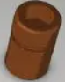 |       | 8     | 1000   | 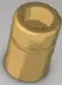  |
| 1     | 0001   | 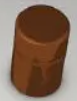 |       | 9     | 1001   | 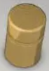  |
| 2     | 0010   | 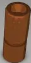 |       | 10    | 1010   | 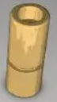 |
| 3     | 0011   | 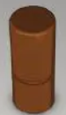 |       | 11    | 1011   | 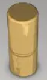 |
| 4     | 0100   | 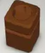 |       | 12    | 1100   | 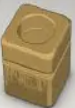 |
| 5     | 0101   | 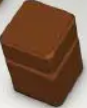 |       | 13    | 1101   | 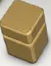 |
| 6     | 0110   | 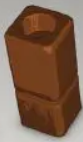 |       | 14    | 1110   | 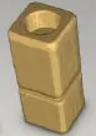 |
| 7     | 0111   | 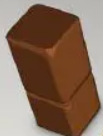 |       | 15    | 1111   | 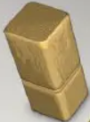 |

#### What does 16 represent?

For pieces, 16 denotes the null piece which is assigned to the current piece when there isn't a current piece selected.
In the case of board positions, 16 denotes an empty cell. The reason for using 0 to 15 to represent the pieces is to get the 4-bit piece representation.

#### Encoding

A board state encoder and decoder are provided with the simulator. The encoding is a 34 character long string compromising 17 numbers. 
Single digit numbers are encoded as "0n" and double digit numbers are written normally. The first 16 numbers are the board encoded row-wise linear indexing.
The last number is the current piece to place at that state of the board.

#### Playing a game

To play a game, you need to pick two agents that match the superclass of a generic Quarto agent and then call the play method. A simple example can be seen below:
```py
from quarto import *
import quarto_agents as qagents

game = QuartoGame(qagents.HumanPlayer(), qagents.RandomQuartoAgent(), gui_mode=True, bin_mode=True)
game.playRandomFirst()
#game.play()
```

You have the option of calling play() or playRandomFirst(). playRandomFirst() will play the first move (hence the first player's move) randomly, which involves randomly selecting a piece for Player 2. This is because that first move isn't really important and doesn't affect the game whatsoever.

gui_mode set to True shows a visual board after every move played.
bin_mode set to True will show the pieces in binary form. Only works if gui_mode=True.

#### Creating your own agent

It is very easy to create your own agent by means of the API provided. Just inherit from the GenericQuartoAgent and override the two methods provided.
The game information received in those two methods is called quartoGameState. This is the structure of that data:
```
[
    current quarto board (4x4 numpy array),
    current piece (integer),
    available pieces (set of integers),
    available positions (set of integers)
]
```
You can reference the game state data structure like an array to get the appropriate data. Check with the quarto class getGameState() method to make sure you are receiving the correct information.

After creating your agent and overriding those methods, just put your agent as an argument in the initialization of a quarto game.
There are already a number of existing agents in the [quarto_agents](quarto_agents) directory. These include a human agent, random agent, negamax agent and genetic minimax agent.

#### Quarto game GUI

A playable GUI version of the game using the Quarto simulator as the backend is currently in development. Check the [gui.py](gui.py) file.

